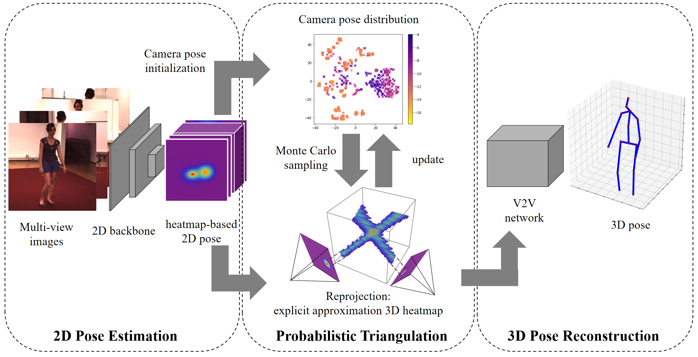

# Probabilistic Triangulation

Code of ICCV 2023 paper: Probabilistic Triangulation for Uncalibrated Multi-View 3D Human Pose Estimation

Abstract: 3D human pose estimation has been a long-standing challenge in computer vision and graphics, where multi-view methods have significantly progressed but are limited by the tedious calibration processes. Existing multi-view methods are restricted to fixed camera pose and therefore lack generalization ability. This paper presents a novel Probabilistic Triangulation module that can be embedded in a calibrated 3D human pose estimation method, generalizing it to uncalibration scenes. The key idea is to use a probability distribution to model the camera pose and iteratively update the distribution from 2D features instead of using camera pose. Specifically, We maintain a camera pose distribution and then iteratively update this distribution by computing the posterior probability of the camera pose through Monte Carlo sampling. This way, the gradients can be directly back-propagated from the 3D pose estimation to the 2D heatmap, enabling end-to-end training. Extensive experiments on Human3.6M and CMU Panoptic demonstrate that our method outperforms other uncalibration methods and achieves comparable results with state-of-the-art calibration methods. Thus, our method achieves a trade-off between estimation accuracy and generalizability.


## Pipeline


## Getting started

### 1. Install

```python
git clone https://github.com/bymaths/probabilistic_triangulation.git
cd probabilistic_triangulation
pip install -r requirements.txt
```

### 2. Dataset

Download and preprocess the dataset by following the instructions in [h36m-fetch](https://github.com/anibali/h36m-fetch) and [learnable triangulation](https://github.com/karfly/learnable-triangulation-pytorch).

### 3. Quick Start

Verified on human3.6m：

```python
python test.py --cfg config/H36M.yaml --weight checkpoints/H36M_point.pth
```

If you want to train on your own dataset：

```python
python train.py --cfg config/H36M.yaml --data ./data
```

## Comments

The data processing code is based on the project of  [h36m-fetch](https://github.com/anibali/h36m-fetch) and [learnable triangulation](https://github.com/karfly/learnable-triangulation-pytorch)](https://github.com/anibali/h36m-fetch).

## Citation

If you find this project useful for your research, please consider citing:

```
@article{hu2023pose,
  title={Probabilistic Triangulation for Uncalibrated Multi-View 3D Human Pose Estimation},
  author={Boyuan Jiang, Lei Hu, Shihong Xia}
  journal={IEEE Transactions on Visualization and Computer Graphics},
  year={2023},
  publisher={IEEE}
}
```

